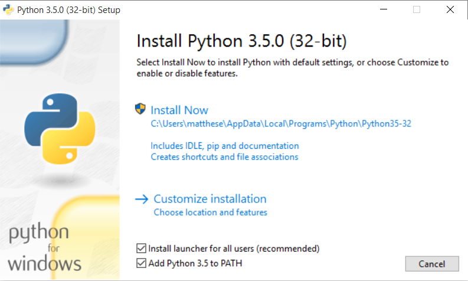

Setup Instructions: Windows
===

- [Checking your current version of Python](#current_version)
- [Installing Python 3.5](#python3.5)
- [Adding Python to Your Path Variable](#path_variable)
- [Installing Geany](#installing_geany)
    - [Configuring Geany](#configuring_geany)

Checking your current version of Python
---

Python may already installed on your system. Open a command window by right-clicking on the Desktop while holding the shift key, and then select "Open Command Window Here". You can also search for "command" in the task bar. Find out which version is your default by issuing the command `python --version`:

    > python --version
    Python 2.7.6

If you see something like this, Python 2.7 is your default version. You should also see if you have Python 3 installed:

    > python3 --version
    Python 3.4.0

If you have Python 3.4 or later, it's fine to start out by using the installed version. If you have Python 3.3 or earlier, it's probably worth installing Python 3.5.

If you get an error message for both of these commands, Python is not installed on your system, and you should install Python 3.5.

[top](#)

Installing Python 3.5
---

Go to [https://www.python.org/downloads/](https://www.python.org/downloads/) and click the button labeled "Download Python 3.5". Download the installer, and when you run it make sure to check the *Add Python to PATH* option:

Checking this button ensures that you'll be able to use the simple command **python**. If you missed this step, see [Adding Python to Your Path Variable](#path_variable).

You can confirm that the installation was successful:

    > python --version
    Python 3.5.0

Now to start a Python terminal session, you'll use the command `python`:

    > python
    Python 3.5.0 (v3.5.0:374f501f4567, Sep 13 2015, 02:16:59) [MSC v.1900 32 bit (Intel)] on win32
    Type "help", "copyright", "credits" or "license" for more information.
    >>>

You'll use this command when you configure your text editor, and when you run programs from the terminal.

[top](#)

Adding Python to Your Path Variable
---
If you checked *Add Python to PATH* when you installed Python and the command **python** works, you can skip this step.

To find the path to Python on your system, open Windows Explorer and look in your C:\ drive. Look for a folder starting with *Python*; you might need to enter *python* in the Windows Explorer search bar to find the right folder. Open the folder, and look for a file with the lowercase name *python*. Right-click this file and choose **Properties**; you'll then see the path to this file under the heading Location.

In a terminal window, use the path to confirm the version you just installed:

    > C:\\Python35\python --version
    Python 3.5.0

Open your system's **Control Panel**, choose **System and Security**, and then choose **System**. Click **Advanced System Settings*, and in the window that pops up click **Environment Variables**.

In the box labeled *System variables*, look for a variable called `Path`. Click **Edit**. In the box that pops up, click in the box labeled *Variable Value* and use the right arrow key to scroll all the way to the right. Be careful not to write over the existing variable; if you do, click Cancel and try again. Add a semicolon and the path to your *python.exe* file to the existing variable:

    %SystemRoot%\system32\...\System32\WindowsPowerShell\v1.0\;C:\Python35

Close any existing terminal windows, and open a new one. Now when you enter **python --version**, you should see the version of Python you just set in your `Path` variable. You can now start a Python terminal session by just entering **python** at a command prompt.

Installing Geany
---

You can download a Windows installer for Geany from [http://www.geany.org/Download/Releases](http://www.geany.org/Download/Releases). Download and run the installer called *geany-1.25_setup.exe*, accepting all the defaults.

[top](#)

### Configuring Geany

If you use the simple command `python` to start a terminal session on your system, you shouldn't have to configure Geany at all. But if you use a command like `python3` or a full path like `C:\Python35\python` to start a terminal session, you'll have to modify Geany slightly so it uses the correct version of Python to run your programs.

Open an empty file and save it as *hello_world.py*. The file should have one line in it:

    print("Hello Python world!")

Go to **Build>Set Build Commands**. You should see the word *Compile*, and a command next to the word *Compile*. Change this to

    python3 -m py_compile "%f"

You can also use a full path in this setting, such as `C:\Python35\python -m py_compile "%f"`.

Next to the word *Execute*, enter the following command:

    python3 "%f"

Again, you can use a full path, such as `C:\Python35\python "%f"`.

Now you can run programs by selecting **Build>Execute**, clicking the Execute icon with a set of gears on it, or by pressing **F5**.

[top](#)

