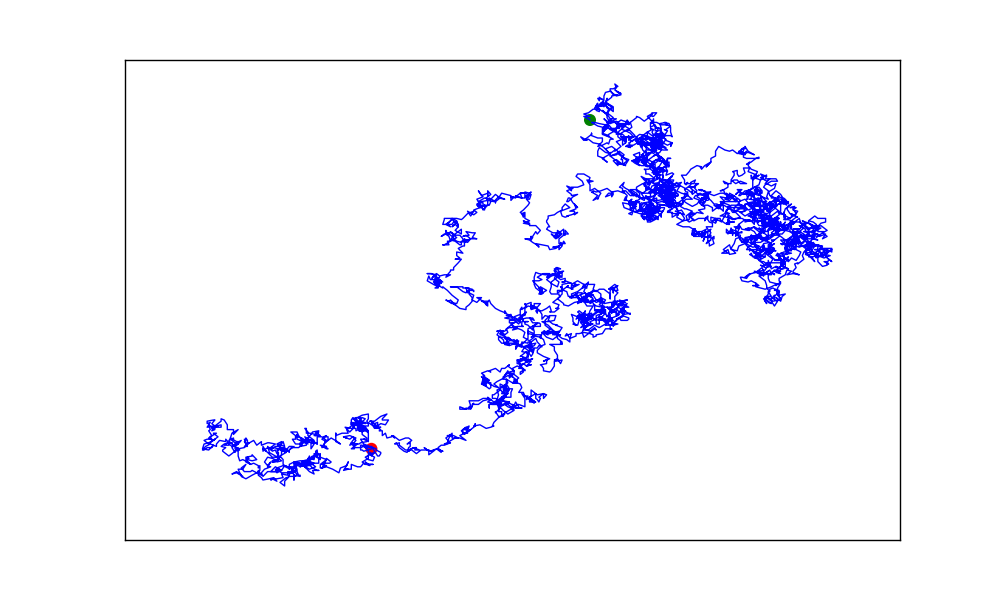
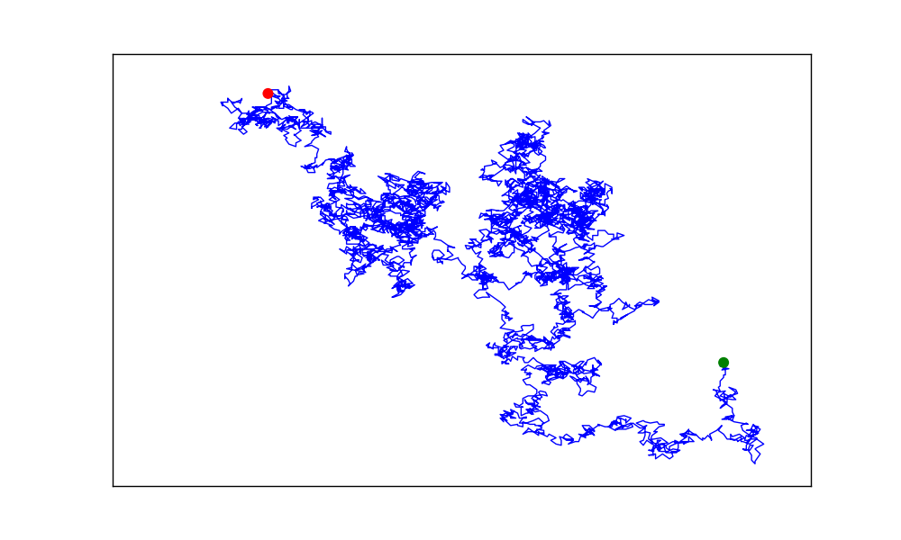
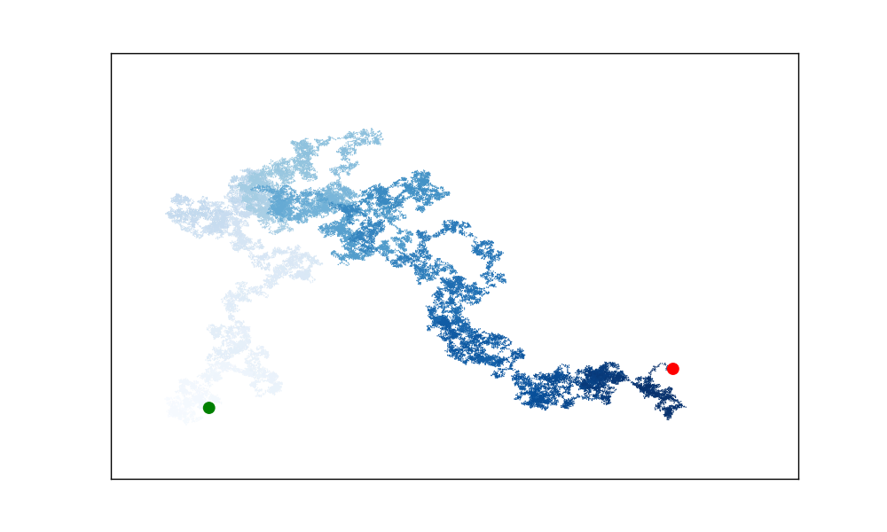
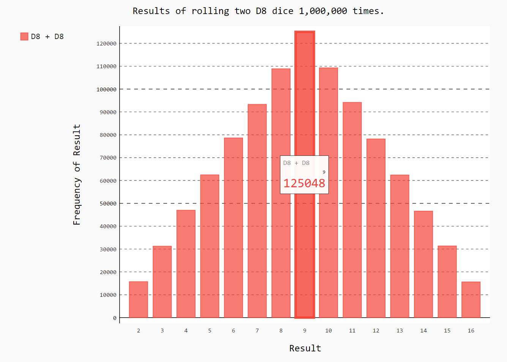
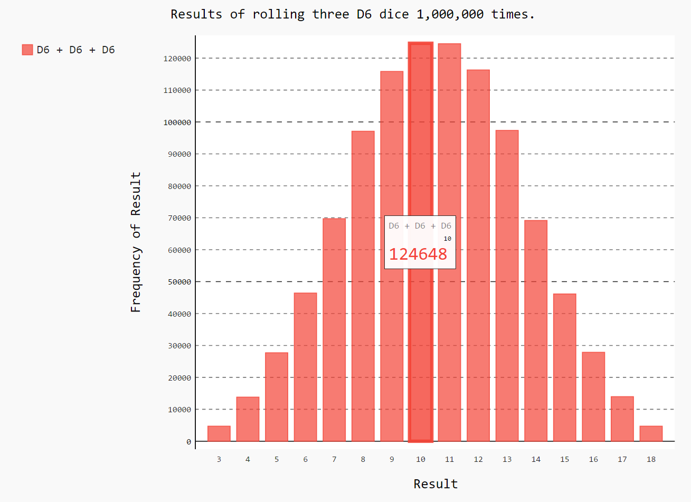

- [15-1: Cubes](#cubes)
- [15-2: Colored Cubes](#colored-cubes)
- [15-3: Molecular Motion](#molecular-motion)
- [15-5: Refactoring](#refactoring)
- [15-6: Automatic Labels](#automatic-labels)
- [15-7: Two D8s](#two-d8s)
- [15-8: Three Dice](#three-dice)
- [15-9: Multiplication](#multiplication)

Back to [solutions](README.html).

15-1: Cubes
---

A number raised to the third power is a *cube*. Plot the first five cubic numbers, and then plot the first 5000 cubic numbers.

Plotting 5 cubes:

```python
from matplotlib import pyplot as plt

# Define data.
x_values = [1, 2, 3, 4, 5]
cubes = [1, 8, 27, 64, 125]

# Make plot.
plt.scatter(x_values, cubes, edgecolor='none', s=40)

# Customize plot.
plt.title("Cubes", fontsize=24)
plt.xlabel('Value', fontsize=14)
plt.ylabel('Cube of Value', fontsize=14)
plt.tick_params(axis='both', labelsize=14)

# Show plot.
plt.show()
```

Output:


Plotting 5000 cubes:

```python
from matplotlib import pyplot as plt

# Define data.
x_values = list(range(5001))
cubes = [x**3 for x in x_values]

# Make plot.
plt.scatter(x_values, cubes, edgecolor='none', s=40)

# Customize plot.
plt.title("Cubes", fontsize=24)
plt.xlabel('Value', fontsize=14)
plt.ylabel('Cube of Value', fontsize=14)
plt.tick_params(axis='both', labelsize=14)
plt.axis([0, 5100, 0, 5100**3])

# Show plot.
plt.show()
```

Output:


[top](#)

15-2: Colored Cubes
---

Apply a colormap to your cubes plot.

```python
from matplotlib import pyplot as plt

# Define data.
x_values = list(range(5001))
cubes = [x**3 for x in x_values]

# Make plot.
plt.scatter(x_values, cubes, edgecolor='none', c=cubes, cmap=plt.cm.BuGn, s=40)

# Customize plot.
plt.title("Cubes", fontsize=24)
plt.xlabel('Value', fontsize=14)
plt.ylabel('Cube of Value', fontsize=14)
plt.tick_params(axis='both', labelsize=14)
plt.axis([0, 5100, 0, 5100**3])

# Show plot.
plt.show()
```

Output:


[top](#)

15-3: Molecular Motion
---

Modify *rw_visual.py* by replacing `plt.scatter()` with `plt.plot()`. to simulate the path of a pollen grain on the surface of a drop of water, pass in the `rw.x_values` and `rw.y_values`, and include a `linewidth` argument. Use 5000 instead of 50,000 points.

```python
import matplotlib.pyplot as plt

from random_walk import RandomWalk

# Keep making new walks, as long as the program is active.
while True:
    # Make a random walk, and plot the points.
    rw = RandomWalk(5000)
    rw.fill_walk()
    
    # Set the size of the plotting window.
    plt.figure(dpi=128, figsize=(10, 6))
    
    point_numbers = list(range(rw.num_points))
    plt.plot(rw.x_values, rw.y_values, linewidth=1)
        
    # Emphasize the first and last points.
    plt.scatter(0, 0, c='green', edgecolors='none', s=75)
    plt.scatter(rw.x_values[-1], rw.y_values[-1], c='red', edgecolors='none',
        s=75)
        
    # Remove the axes.
    plt.axes().get_xaxis().set_visible(False)
    plt.axes().get_yaxis().set_visible(False)
        
    plt.show()
    
    keep_running = input("Make another walk? (y/n): ")
    if keep_running == 'n':
        break
```

Output:



The scatter plots appear behind the lines. To place them on top of the lines, we can use the `zorder` argument. Plot elements with higher `zorder` values are placed on top of elements with lower `zorder` values.

```python
import matplotlib.pyplot as plt

from random_walk import RandomWalk

# Keep making new walks, as long as the program is active.
while True:
    # Make a random walk, and plot the points.
    rw = RandomWalk(5000)
    rw.fill_walk()
    
    # Set the size of the plotting window.
    plt.figure(dpi=128, figsize=(10, 6))
    
    point_numbers = list(range(rw.num_points))
    plt.plot(rw.x_values, rw.y_values, linewidth=1, zorder=1)
        
    # Emphasize the first and last points.
    plt.scatter(0, 0, c='green', edgecolors='none', s=75, zorder=2)
    plt.scatter(rw.x_values[-1], rw.y_values[-1], c='red', edgecolors='none',
        s=75, zorder=2)
        
    # Remove the axes.
    plt.axes().get_xaxis().set_visible(False)
    plt.axes().get_yaxis().set_visible(False)
        
    plt.show()
    
    keep_running = input("Make another walk? (y/n): ")
    if keep_running == 'n':
        break
```

Output:



[top](#)

15-5: Refactoring
---

The method `fill_walk()` is lengthy. Create a new method called `get_step()` to determine the direction and distance for each step, and then calculate the step. You should end up with two calls to `get_step()` in `fill_walk()`:

```python
x_step = get_step()
y_step = get_step()
```

This refactoring should reduce the size of `fill_walk()` and make the method easier to read and understand.

*random_walk.py:*

```python
from random import choice

class RandomWalk():
    """A class to generate random walks."""
    
    def __init__(self, num_points=5000):
        """Initialize attributes of a walk."""
        self.num_points = num_points
        
        # All walks start at (0, 0).
        self.x_values = [0]
        self.y_values = [0]

    def get_step(self):
        """Determine the direction and distance for a step."""
        direction = choice([1, -1])
        distance = choice([0, 1, 2, 3, 4])
        step = direction * distance
        return step

    def fill_walk(self):
        """Calculate all the points in the walk."""
        
        # Keep taking steps until the walk reaches the desired length.
        while len(self.x_values) < self.num_points:
            
            # Decide which direction to go, and how far to go in that direction.
            x_step = self.get_step()
            y_step = self.get_step()
            
            # Reject moves that go nowhere.
            if x_step == 0 and y_step == 0:
                continue
            
            # Calculate the next x and y values.
            next_x = self.x_values[-1] + x_step
            next_y = self.y_values[-1] + y_step
            
            self.x_values.append(next_x)
            self.y_values.append(next_y)
```

Output:



[top](#)

15-6: Automatic Labels
---

Modify *die.py* and *dice_visual.py* by replacing the list we used to set the value of `hist.x_labels` with a loop to generate this list automatically. If you're comfortable with list comprehensions, try replacing the other `for` loops in *die_visual.py* and *dice_visual.py* with comprehensions as well.

***Note:** This should say to modify die_visual.py, not die.py. This will be corrected in future printings.

*die_visual.py:*

```python
import pygal

from die import Die

# Create a D6.
die = Die()

# Make some rolls, and store results in a list.
results = [die.roll() for roll_num in range(1000)]
    
# Analyze the results.
frequencies = [results.count(value) for value in range(1, die.num_sides+1)]
    
# Visualize the results.
hist = pygal.Bar()

hist.title = "Results of rolling one D6 1000 times."
hist.x_labels = [str(x) for x in range(1, die.num_sides+1)]
hist.x_title = "Result"
hist.y_title = "Frequency of Result"

hist.add('D6', frequencies)
hist.render_to_file('die_visual.svg')
```

*dice_visual.py:*

```python
import pygal

from die import Die

# Create two D6 dice.
die_1 = Die()
die_2 = Die()

# Make some rolls, and store results in a list.
results = [die_1.roll() + die_2.roll() for roll_num in range(1000)]
    
# Analyze the results.
max_result = die_1.num_sides + die_2.num_sides
frequencies = [results.count(value) for value in range(2, max_result+1)]
    
# Visualize the results.
hist = pygal.Bar()

hist.title = "Results of rolling two D6 dice 1000 times."
hist.x_labels = [str(x) for x in range(2, max_result+1)]
hist.x_title = "Result"
hist.y_title = "Frequency of Result"

hist.add('D6 + D6', frequencies)
hist.render_to_file('dice_visual.svg')
```

[top](#)

15-7: Two D8s
---

Create a simulation showing what happens if you roll two eight-sided dice 1000 times. Increase the number of rolls gradually until you start to see the limits of your system's capabilities.

```python
import pygal

from die import Die

# Create two D8 dice.
die_1 = Die(8)
die_2 = Die(8)

# Make some rolls, and store results in a list.
results = []
for roll_num in range(1000000):
    result = die_1.roll() + die_2.roll()
    results.append(result)
    
# Analyze the results.
frequencies = []
max_result = die_1.num_sides + die_2.num_sides
for value in range(2, max_result+1):
    frequency = results.count(value)
    frequencies.append(frequency)
    
# Visualize the results.
hist = pygal.Bar()

hist.title = "Results of rolling two D8 dice 1,000,000 times."
hist.x_labels = [str(x) for x in range(2, max_result+1)]
hist.x_title = "Result"
hist.y_title = "Frequency of Result"

hist.add('D8 + D8', frequencies)
hist.render_to_file('dice_visual.svg')
```

Note: This solution only uses a list comprehension for the `hist.x_labels` parameter. You might want to try replacing the other loops with comprehensions as well.

Output:



[top](#)

15-8: Three Dice
---

If you roll three D6 dice, the smallest number you can roll is 3 and the largest number is 18. Create a visualization that shows what happens when you roll three D6 dice.

```python
import pygal

from die import Die

# Create three D6 dice.
die_1 = Die()
die_2 = Die()
die_3 = Die()

# Make some rolls, and store results in a list.
results = []
for roll_num in range(1000000):
    result = die_1.roll() + die_2.roll() + die_3.roll()
    results.append(result)
    
# Analyze the results.
frequencies = []
max_result = die_1.num_sides + die_2.num_sides + die_3.num_sides
for value in range(3, max_result+1):
    frequency = results.count(value)
    frequencies.append(frequency)
    
# Visualize the results.
hist = pygal.Bar()

hist.title = "Results of rolling three D6 dice 1,000,000 times."
hist.x_labels = [str(x) for x in range(3, max_result+1)]
hist.x_title = "Result"
hist.y_title = "Frequency of Result"

hist.add('D6 + D6 + D6', frequencies)
hist.render_to_file('dice_visual.svg')
```

Note: This solution only uses a list comprehension for the `hist.x_labels` parameter. You might want to try replacing the other loops with comprehensions as well.

Output:



[top](#)