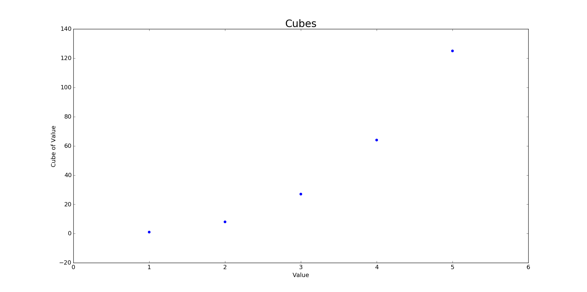
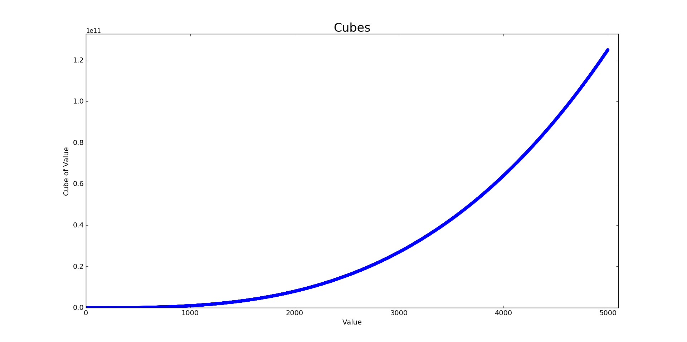
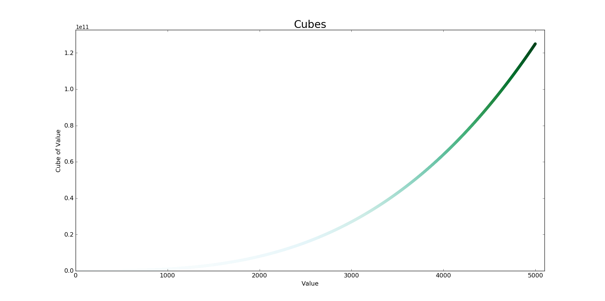

- [15-1: Cubes](#cubes)
- [15-2: Colored Cubes](#colored-cubes)

Back to [solutions](README.html).

15-1: Cubes
---

A number raised to the third power is a *cube*. Plot the first five cubic numbers, and then plot the first 5000 cubic numbers.

Plotting 5 cubes:

```python
from matplotlib import pyplot as plt

# Define data.
x_values = [1, 2, 3, 4, 5]
cubes = [1, 8, 27, 64, 125]

# Make plot.
plt.scatter(x_values, cubes, edgecolor='none', s=40)

# Customize plot.
plt.title("Cubes", fontsize=24)
plt.xlabel('Value', fontsize=14)
plt.ylabel('Cube of Value', fontsize=14)
plt.tick_params(axis='both', labelsize=14)

# Show plot.
plt.show()
```

Output:



Plotting 5000 cubes:

```python
from matplotlib import pyplot as plt

# Define data.
x_values = list(range(5001))
cubes = [x**3 for x in x_values]

# Make plot.
plt.scatter(x_values, cubes, edgecolor='none', s=40)

# Customize plot.
plt.title("Cubes", fontsize=24)
plt.xlabel('Value', fontsize=14)
plt.ylabel('Cube of Value', fontsize=14)
plt.tick_params(axis='both', labelsize=14)
plt.axis([0, 5100, 0, 5100**3])

# Show plot.
plt.show()
```

Output:



[top](#)

15-2: Colored Cubes
---

Apply a colormap to your cubes plot.

```python
from matplotlib import pyplot as plt

# Define data.
x_values = list(range(5001))
cubes = [x**3 for x in x_values]

# Make plot.
plt.scatter(x_values, cubes, edgecolor='none', c=cubes, cmap=plt.cm.BuGn, s=40)

# Customize plot.
plt.title("Cubes", fontsize=24)
plt.xlabel('Value', fontsize=14)
plt.ylabel('Cube of Value', fontsize=14)
plt.tick_params(axis='both', labelsize=14)
plt.axis([0, 5100, 0, 5100**3])

# Show plot.
plt.show()
```

Output:



[top](#)