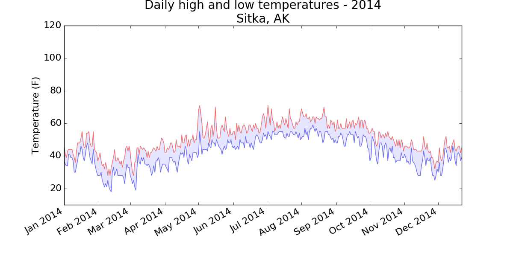
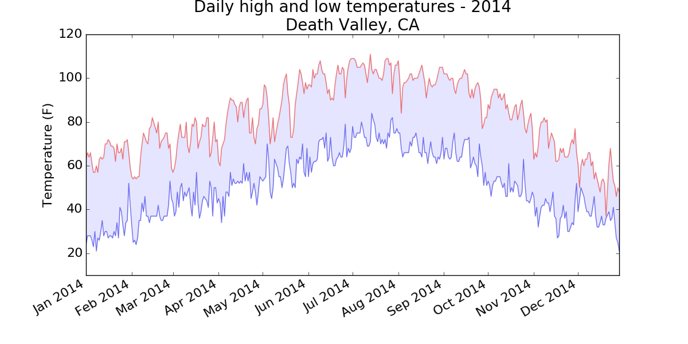
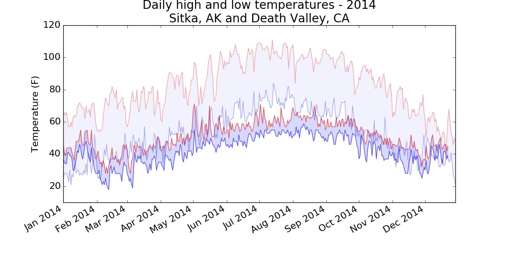
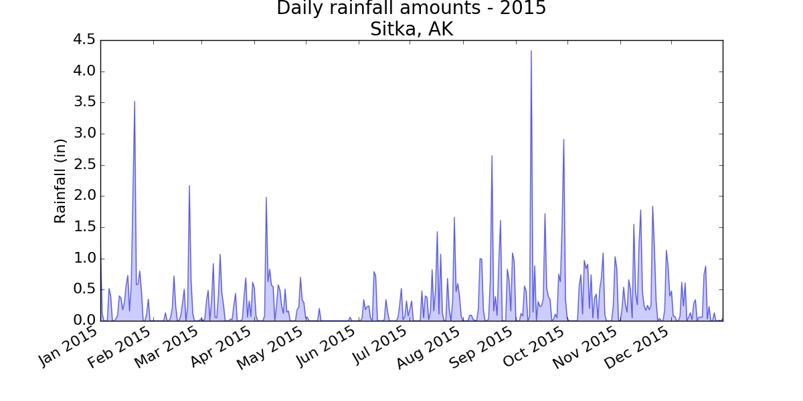
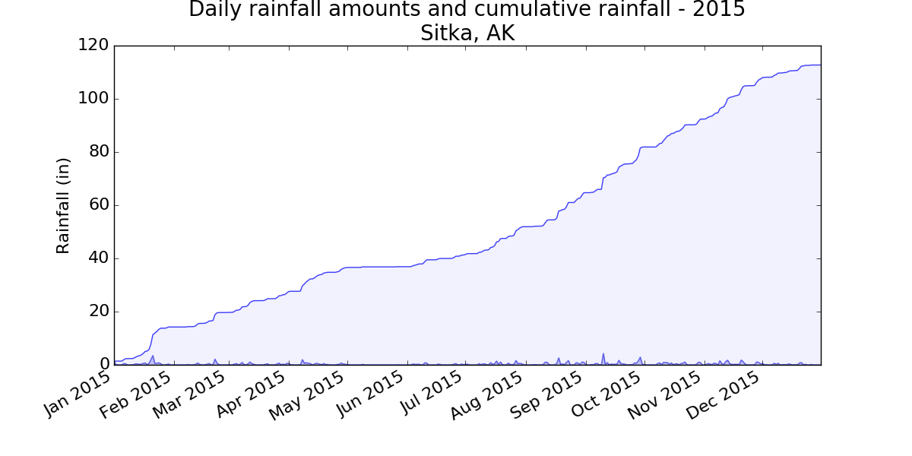

- [16-2: Sitka-Death Valley Comparison](#sitka-death-valley-comparison)
- [16-3: Rainfall](#rainfall)
- [16-4: Explore](#explore)

Back to [solutions](README.html).

16-2: Sitka-Death Valley Comparison
---

The temperature scales on the Sitka and Death Valley graphs reflect the different ranges of the data. To accurately compare the temperature range in Sitka to that of Death Valley, you need identical scales on the y-axis. Change the settings for the y-axis on one or both of the charts in Figures 16-5 and 16-6, and make a direct comparison between temperature ranges in Sitka and Death Valley (or any two places you want to compare). You can also try plotting the two data sets on the same chart.

The `pyplot` function [`ylim()`](http://matplotlib.org/api/pyplot_api.html#matplotlib.pyplot.ylim) allows you to set the limits of just the y-axis. If you ever need to specify the limits of the x-axis, there's a corresponding [`xlim()`](http://matplotlib.org/api/pyplot_api.html#matplotlib.pyplot.xlim) function as well.

```python
import csv
from datetime import datetime

from matplotlib import pyplot as plt

# Get dates, high, and low temperatures from file.
filename = 'sitka_weather_2014.csv'
with open(filename) as f:
    reader = csv.reader(f)
    header_row = next(reader)

    dates, highs, lows = [], [], []
    for row in reader:
        try:
            current_date = datetime.strptime(row[0], "%Y-%m-%d")
            high = int(row[1])
            low = int(row[3])
        except ValueError:
            print(current_date, 'missing data')
        else:
            dates.append(current_date)
            highs.append(high)
            lows.append(low)

# Plot data.
fig = plt.figure(dpi=128, figsize=(10, 6))
plt.plot(dates, highs, c='red', alpha=0.5)
plt.plot(dates, lows, c='blue', alpha=0.5)
plt.fill_between(dates, highs, lows, facecolor='blue', alpha=0.1)

# Format plot.
title = "Daily high and low temperatures - 2014\nSitka, AK"
plt.title(title, fontsize=20)
plt.xlabel('', fontsize=16)
fig.autofmt_xdate()
plt.ylabel("Temperature (F)", fontsize=16)
plt.tick_params(axis='both', which='major', labelsize=16)
plt.ylim(10, 120)

plt.show()
```

Output:



Using the same limits for the `ylim()` function with the Death Valley data results in a chart that has the same scale:



There are a number of ways you can approach plotting both data sets on the same chart. In the following solution, we put the code for reading the csv file into a function. We then call it once to grab the highs and lows for Sitka before making the chart, and then call the function a second time to add Death Valley's data to the existing plot. The colors have been adjusted slightly to make each location's data distinct.

```python
import csv
from datetime import datetime

from matplotlib import pyplot as plt

def get_weather_data(filename, dates, highs, lows):
    """Get the highs and lows from a data file."""
    with open(filename) as f:
        reader = csv.reader(f)
        header_row = next(reader)

        # dates, highs, lows = [], [], []
        for row in reader:
            try:
                current_date = datetime.strptime(row[0], "%Y-%m-%d")
                high = int(row[1])
                low = int(row[3])
            except ValueError:
                print(current_date, 'missing data')
            else:
                dates.append(current_date)
                highs.append(high)
                lows.append(low)

# Get weather data for Sitka.
dates, highs, lows = [], [], []
get_weather_data('sitka_weather_2014.csv', dates, highs, lows)

# Plot Sitka weather data.
fig = plt.figure(dpi=128, figsize=(10, 6))
plt.plot(dates, highs, c='red', alpha=0.6)
plt.plot(dates, lows, c='blue', alpha=0.6)
plt.fill_between(dates, highs, lows, facecolor='blue', alpha=0.15)

# Get Death Valley data.
dates, highs, lows = [], [], []
get_weather_data('death_valley_2014.csv', dates, highs, lows)

# Add Death Valley data to current plot.
plt.plot(dates, highs, c='red', alpha=0.3)
plt.plot(dates, lows, c='blue', alpha=0.3)
plt.fill_between(dates, highs, lows, facecolor='blue', alpha=0.05)

# Format plot.
title = "Daily high and low temperatures - 2014"
title += "\nSitka, AK and Death Valley, CA"
plt.title(title, fontsize=20)
plt.xlabel('', fontsize=16)
fig.autofmt_xdate()
plt.ylabel("Temperature (F)", fontsize=16)
plt.tick_params(axis='both', which='major', labelsize=16)
plt.ylim(10, 120)

plt.show()
```



[top](#)

16-3: Rainfall
---

Choose any location you're interested in, and make a visualization that plots its rainfall. Start by focusing on one month's data, and then once your code is working, run it for a full year's data.

***Note:** You can find the data file for this example [here](https://github.com/ehmatthes/pcc/blob/gh-pages/resources/sitka_rainfall_2015.csv).*

```python
import csv
from datetime import datetime

from matplotlib import pyplot as plt

# Get dates and rainfall data from data file.
#  Rainfall data is in column 19.
filename = 'sitka_rainfall_2015.csv'
with open(filename) as f:
    reader = csv.reader(f)
    header_row = next(reader)

    dates, rainfalls = [], []
    for row in reader:
        try:
            current_date = datetime.strptime(row[0], "%Y-%m-%d")
            rainfall = float(row[19])
        except ValueError:
            print(current_date, 'missing data')
        else:
            dates.append(current_date)
            rainfalls.append(rainfall)

# Plot data.
fig = plt.figure(dpi=128, figsize=(10, 6))
plt.plot(dates, rainfalls, c='blue', alpha=0.5)
plt.fill_between(dates, rainfalls, facecolor='blue', alpha=0.2)

# Format plot.
title = "Daily rainfall amounts - 2015\nSitka, AK"
plt.title(title, fontsize=20)
plt.xlabel('', fontsize=16)
fig.autofmt_xdate()
plt.ylabel("Rainfall (in)", fontsize=16)
plt.tick_params(axis='both', which='major', labelsize=16)

plt.show()
```

Output:



[top](#)

16-4: Explore
---

Generate a few more visualizations that examine any other weather aspect you're interested in for any locations you're curious about.

I live in a rainforest, so I was interested in playing with the rainfall data. I calculated the cumulative rainfall for the year, and plotted that over the daily rainfall. Even after living in this rain, I'm surprised to see how much we get.

```python
import csv
from datetime import datetime

from matplotlib import pyplot as plt

# Get dates and rainfall data from data file.
#  Rainfall data is in column 19.
filename = 'sitka_rainfall_2015.csv'
with open(filename) as f:
    reader = csv.reader(f)
    header_row = next(reader)

    dates, rainfalls, totals = [], [], []
    for row in reader:
        try:
            current_date = datetime.strptime(row[0], "%Y-%m-%d")
            rainfall = float(row[19])
        except ValueError:
            print(current_date, 'missing data')
        else:
            dates.append(current_date)
            rainfalls.append(rainfall)
            if totals:
                totals.append(totals[-1] + rainfall)
            else:
                totals.append(rainfall)

# Plot data.
fig = plt.figure(dpi=128, figsize=(10, 6))
plt.plot(dates, rainfalls, c='blue', alpha=0.5)
plt.fill_between(dates, rainfalls, facecolor='blue', alpha=0.2)

plt.plot(dates, totals, c='blue', alpha=0.75)
plt.fill_between(dates, totals, facecolor='blue', alpha=0.05)

# Format plot.
title = "Daily rainfall amounts and cumulative rainfall - 2015\nSitka, AK"
plt.title(title, fontsize=20)
plt.xlabel('', fontsize=16)
fig.autofmt_xdate()
plt.ylabel("Rainfall (in)", fontsize=16)
plt.tick_params(axis='both', which='major', labelsize=16)

plt.show()
```

Output:



[top](#)