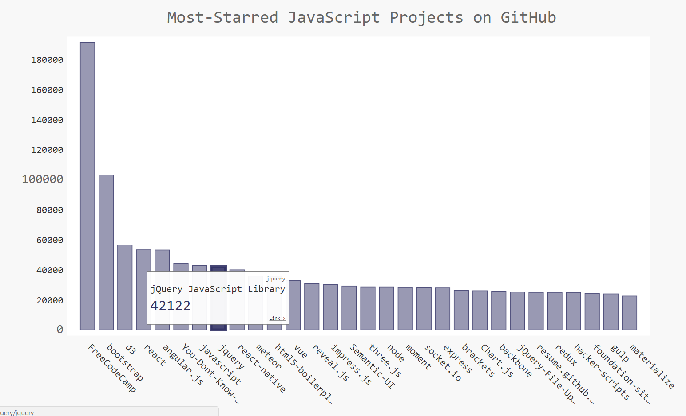
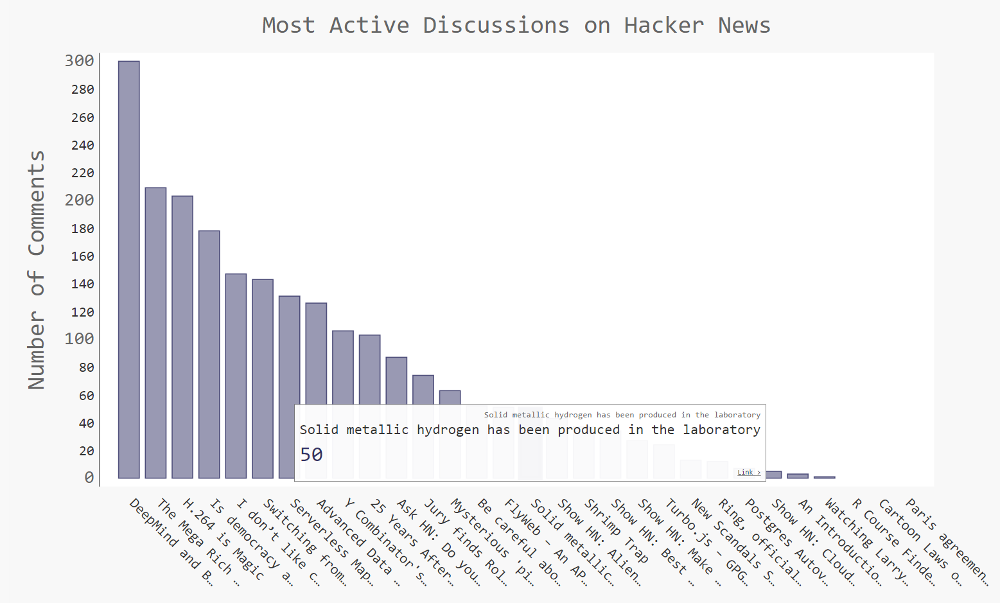

- [17-1: Other Languages](#other-languages)
- [17-2: Active Discussions](#active-discussions)
- [17-3: Testing *python_repos.py*](#testing-pythonrepos)

Back to [solutions](README.html).

17-1: Other Languages
---

Modify the API call in *python_repos.py* so it generates a chart showing the most popular projects in other languages. Try languages such as *JavaScript*, *Ruby*, *C*, *Java*, *Perl*, *Haskell*, and *Go*.

***Note:** The code for this exercise includes an [update](../chapter_17/README.html) that keeps a project with an empty description from breaking the program, and moves the font size settings to `my_style`.*

```python
import requests
import pygal
from pygal.style import LightColorizedStyle as LCS, LightenStyle as LS

# Make an API call, and store the response.
url = 'https://api.github.com/search/repositories?q=language:javascript&sort=stars'
r = requests.get(url)
print("Status code:", r.status_code)

# Store API response in a variable.
response_dict = r.json()
print("Total repositories:", response_dict['total_count'])

# Explore information about the repositories.
repo_dicts = response_dict['items']

names, plot_dicts = [], []
for repo_dict in repo_dicts:
    names.append(repo_dict['name'])

    # When a project is removed, it's still listed with stars.
    #   So it's in the top projects, but has no description. The description
    #   is None, which causes an exception when being used as a label.
    if repo_dict['description']:
        desc = repo_dict['description']
    else:
        desc = 'No description provided.'
    
    plot_dict = {
        'value': repo_dict['stargazers_count'],
        'label': desc,
        'xlink': repo_dict['html_url'],
        }
    plot_dicts.append(plot_dict)

# Make visualization.
my_style = LS('#333366', base_style=LCS)
my_style.title_font_size = 24
my_style.label_font_size = 14
my_style.major_label_font_size = 18

my_config = pygal.Config()
my_config.x_label_rotation = 45
my_config.show_legend = False
my_config.truncate_label = 15
my_config.show_y_guides = False
my_config.width = 1000

chart = pygal.Bar(my_config, style=my_style)
chart.title = 'Most-Starred JavaScript Projects on GitHub'
chart.x_labels = names

chart.add('', plot_dicts)
chart.render_to_file('js_repos.svg')
```

Output:



[top](#)

17-2: Active Discussions
---

Using the data from *hn_submissions.py*, make a bar chart showing the most active discussions currently happening on Hacker News. The height of each bar should correspond to the number of comments each submission has. The label for each bar should include the submission's title, and each bar should act as a link to the discussion page for that submission.

```python
import requests
import pygal
from pygal.style import LightColorizedStyle as LCS, LightenStyle as LS

from operator import itemgetter

# Make an API call, and store the response.
url = 'https://hacker-news.firebaseio.com/v0/topstories.json'
r = requests.get(url)
print("Status code:", r.status_code)

# Process information about each submission.
submission_ids = r.json()
submission_dicts = []
for submission_id in submission_ids[:30]:
    # Make a separate API call for each submission.
    url = ('https://hacker-news.firebaseio.com/v0/item/' +
            str(submission_id) + '.json')
    submission_r = requests.get(url)
    print(submission_r.status_code)
    response_dict = submission_r.json()
    
    submission_dict = {
        'title': response_dict['title'],
        'link': 'http://news.ycombinator.com/item?id=' + str(submission_id),
        'comments': response_dict.get('descendants', 0)
        }
    submission_dicts.append(submission_dict)
    
submission_dicts = sorted(submission_dicts, key=itemgetter('comments'),
                            reverse=True)

for submission_dict in submission_dicts:
    print("\nTitle:", submission_dict['title'])
    print("Discussion link:", submission_dict['link'])
    print("Comments:", submission_dict['comments'])

titles, plot_dicts = [], []
for submission_dict in submission_dicts:
    titles.append(submission_dict['title'])
    plot_dict = {
        'value': submission_dict['comments'],
        'label': submission_dict['title'],
        'xlink': submission_dict['link'],
        }
    plot_dicts.append(plot_dict)

# Make visualization.
my_style = LS('#333366', base_style=LCS)
my_style.title_font_size = 24
my_style.label_font_size = 14
my_style.major_label_font_size = 18

my_config = pygal.Config()
my_config.x_label_rotation = 45
my_config.show_legend = False
my_config.truncate_label = 15
my_config.show_y_guides = False
my_config.width = 1000
my_config.y_title = 'Number of Comments'

chart = pygal.Bar(my_config, style=my_style)
chart.title = 'Most Active Discussions on Hacker News'
chart.x_labels = titles

chart.add('', plot_dicts)
chart.render_to_file('hn_discussions.svg')
```

Output:



[top](#)